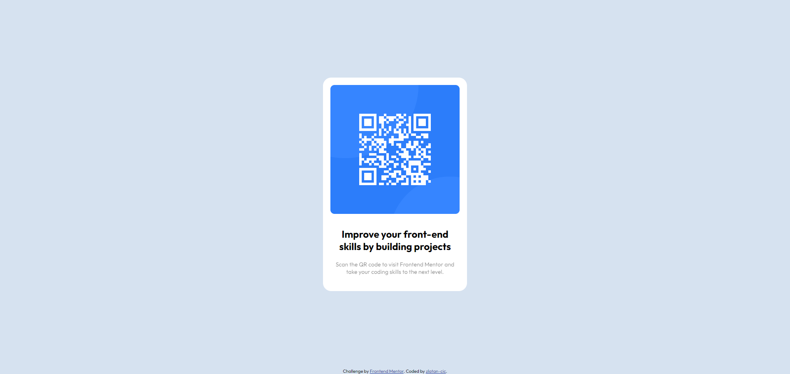

# Frontend Mentor - QR code component solution
This is a learning path form  [Frontend Mentor](https://www.frontendmentor.io)

### Screenshot

### Links
- Live Site URL: [Add live site URL here](https://zlatan-cic.github.io/QR-code/)

### Built with

- Semantic HTML5 markup
- CSS custom properties
- Flexbox

## Author

- GitHub - [zlatan-cic](https://github.com/zlatan-cic)
- Frontend Mentor - [@zlatan-cic](https://www.frontendmentor.io/profile/yourusername)
- Twitter - [@Zlatan_cic](https://twitter.com/Zlatan_cic)

## Acknowledgments

This project was inspired and built upon a challenge provided by Frontend Mentor. [Frontend Mentor](https://www.frontendmentor.io) offers a variety of real-world web development projects that simulate a professional workflow and encourage practical coding experience. I am thankful for the opportunity to tackle such challenges that enhance my front-end development skills and allow me to experiment with new ideas and technologies in a structured environment. A special thanks to Frontend Mentor for providing such an invaluable resource to the developer community.

